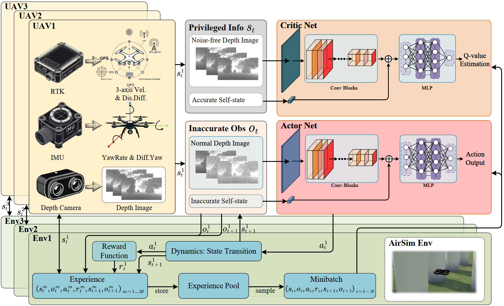

# Vision-Based Deep Reinforcement Learning for UAV Autonomous Navigation with Privileged Information

This repository contains the official implementation of the paper: **“Vision-Based Deep Reinforcement Learning of Unmanned Aerial Vehicle (UAV) Autonomous Navigation Using Privileged Information”**, Drones, 2024 – [link to the article](https://www.mdpi.com/2504-446X/8/12/782).

Repository derived from and extending [UAV_Navigation_DRL_AirSim](https://github.com/heleidsn/UAV_Navigation_DRL_AirSim). We thank the original authors for releasing their code.

---

## Overview

The project introduces a Distributed Privileged Reinforcement Learning (DPRL) framework that improves robustness under partial observability by giving the critic access to privileged information while the actor learns from noisy visual input.  

Our proposed DPRL framework is as followed:


A video demonstrating the autonomous navigation is shown below.


Key elements:

* OpenAI-Gym style environment built on Microsoft AirSim  
* Support for navigation and hovering tasks  
* Single-agent and multi-agent (parallel data collection) training  
* Optional privileged learning schemes

---

## Implemented functionality

| Category                    | Options                                                                                                              |
|-----------------------------|----------------------------------------------------------------------------------------------------------------------|
| **Perception input**        | Clean depth images (depth) · Noisy depth images (depth_noise)                                                                              |
| **Privileged learning**     | No Privileged Learning (no) – actor and critic use noisy images only<br>Privileged-Only Learning (noise_symmetry) – critic uses privileged state only, actor uses noisy images<br>Hybrid Privileged Learning (noise_asymmetry) – critic uses both noisy and privileged inputs, actor uses noisy images |
| **Training mode**           | Single environment · Multi-agent experience collection (launch several UE4 instances, each with a unique `port`)   |
| **Task type**               | Navigation (Nav) · Hovering (Hover)                                                                                               |

The base Unreal environment is provided through a [Google Drive link](https://drive.google.com/file/d/1MinMEPaCFjhOizRxF32gv4pAq0Z_tRvz/view?usp=drive_link); at runtime the code procedurally spawns obstacles.

---

## Setup

### 1. Clone the repository

```bash
git clone https://github.com/your_org/UAV_Navigation_DPRL.git
cd UAV_Navigation_DPRL
```

### 2. Install AirSim
Follow the official instructions on the [AirSim GitHub page](https://github.com/microsoft/AirSim).

### 3. Create and activate the Python environment
```bash
conda create -n uav_dprl python=3.8
conda activate uav_dprl
pip install -r requirements.txt
```

### 4. Configure AirSim settings
Copy `airsim_settings/settings.json` to the AirSim settings directory.
- Windows: `C:\Users\<UserName>\Documents\AirSim\settings.json`
- Linux: `~/Documents/AirSim/settings.json`
---
## Directory structure
```pgsql
airsim_settings/    AirSim configuration files
configs/            Training and environment *.ini files
example/            Pre-trained demonstration model
gym_env/            Custom Gym environments
scripts/            Training / evaluation entry points
stable_baselines3/  Local SB3 fork modified for DPRL
```
---
## Running experiments
### Single-agent training
```bash
cd scripts
python start_train_with_plot.py
```
### Multi-agent (parallel) training
```bash
cd scripts
python start_train_with_mae.py
```
Ensure that each UE4 environment instance is started with a unique port specified in its settings.json.
### Evaluation with live plots
```bash
cd scripts
python start_eval_with_plot.py
```
---
## Citation
If you use this code, please cite:
```bash
@Article{drones8120782,
  AUTHOR  = {Wang, Junqiao and Yu, Zhongliang and Zhou, Dong and Shi, Jiaqi and Deng, Runran},
  TITLE   = {Vision-Based Deep Reinforcement Learning of Unmanned Aerial Vehicle (UAV) Autonomous Navigation Using Privileged Information},
  JOURNAL = {Drones},
  VOLUME  = {8},
  NUMBER  = {12},
  YEAR    = {2024},
  ARTICLE-NUMBER = {782},
  DOI     = {10.3390/drones8120782},
  URL     = {https://www.mdpi.com/2504-446X/8/12/782}
}
```
---
## Contact
For any issues, please feel free to contact me (23S004019@stu.hit.edu.cn). If you find this work interesting or useful, please kindly give us a star.

Thank you!
